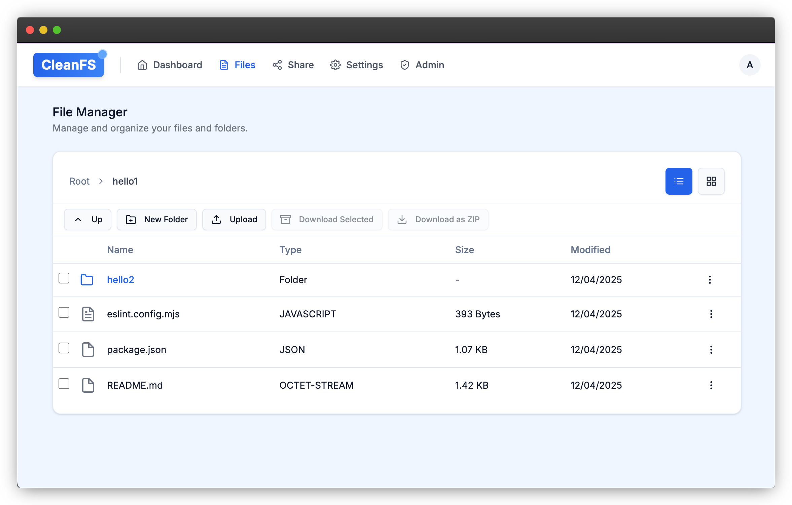

# CleanFS - Modern File Management System

<div align="center">
  
  <br><br>
  <p><strong>A secure, efficient, and user-friendly file management system</strong></p>
</div>



## Overview

CleanFS is a modern file management application built with Next.js and Supabase that provides a secure and intuitive way to store, organize, and share files. With a focus on clean design and robust security, CleanFS offers a seamless file management experience for individuals and teams.

## Features

- **Secure Authentication**: User registration with admin approval system
- **Role-Based Access Control**: Different permissions for admins and regular users
- **Hybrid Storage System**: 
  - Primary: Supabase storage for cross-browser/device access
  - Fallback: Client-side storage (localStorage + IndexedDB) when Supabase operations fail
- **Intuitive File Management**: Upload, download, organize, and share files with ease
- **Modern UI**: Clean, responsive interface built with modern web technologies
- **Dark Mode Support**: Comfortable viewing experience in any lighting condition

## Tech Stack

- **Frontend**: Next.js, React, TypeScript
- **UI Components**: Shadcn UI, Tailwind CSS
- **Authentication**: Supabase Auth
- **Storage**: Supabase Storage with client-side fallback
- **Database**: Supabase PostgreSQL
- **Form Handling**: React Hook Form with Zod validation

## Getting Started

### Prerequisites

- Node.js 16.x or later
- npm or yarn
- Supabase account and project

### Environment Setup

Create a `.env.local` file in the root directory with the following variables:

```
NEXT_PUBLIC_SUPABASE_URL=your_supabase_url
NEXT_PUBLIC_SUPABASE_ANON_KEY=your_supabase_anon_key
SUPABASE_SERVICE_ROLE_KEY=your_supabase_service_role_key
```

### Installation

```bash
# Clone the repository
git clone https://github.com/babanomania/clean-file-manager.git
cd clean-file-manager

# Install dependencies
npm install
# or
yarn install

# Run the development server
npm run dev
# or
yarn dev
```

Open [http://localhost:3000](http://localhost:3000) in your browser to see the application.

### Database Setup

Run the following SQL script in your Supabase SQL Editor to set up the necessary tables and policies:

```bash
npm run migrate
```

Or manually run the SQL scripts in the `src/migrations` directory.

### Creating an Admin User

To create your first admin user:

```bash
npm run create:admin-simple
```

This will create an admin user with:
- Email: admin@cleanfs.com
- Password: Admin123!

**Important**: Change this password immediately after first login!

## User Management

### User Registration Flow

1. Users register through the signup page
2. New accounts require admin approval
3. Admins can approve users through the admin panel
4. Once approved, users can log in and access the system

### Admin Capabilities

- Approve or revoke user access
- Grant or remove admin privileges
- View all registered users

## Development

### Available Scripts

- `npm run dev` - Start the development server
- `npm run build` - Build the application for production
- `npm run start` - Start the production server
- `npm run lint` - Run ESLint
- `npm test` - Run tests
- `npm run create:admin` - Create a custom admin user
- `npm run create:sample-admin` - Create a sample admin user
- `npm run create:admin-simple` - Create an admin user with simplified process
- `npm run fix:admin-role` - Fix admin role issues

## Known Issues & Todo

The following features are planned for future development:

1. **Kubernetes Support**: Add Kubernetes deployment configurations for container orchestration and scalability
2. **Automatic Backups**: Implement scheduled automatic backups of user files and database content
3. **Enhanced Security**: Further improve security measures for file sharing and storage
4. **API Documentation**: Create comprehensive API documentation for integration with other services

Contributions to implement these features are welcome!

## License

This project is licensed under the MIT License - see the LICENSE file for details.

## Acknowledgements

- [Next.js](https://nextjs.org/)
- [Supabase](https://supabase.io/)
- [Shadcn UI](https://ui.shadcn.com/)
- [Tailwind CSS](https://tailwindcss.com/)
- [React Hook Form](https://react-hook-form.com/)
- [Zod](https://github.com/colinhacks/zod)
